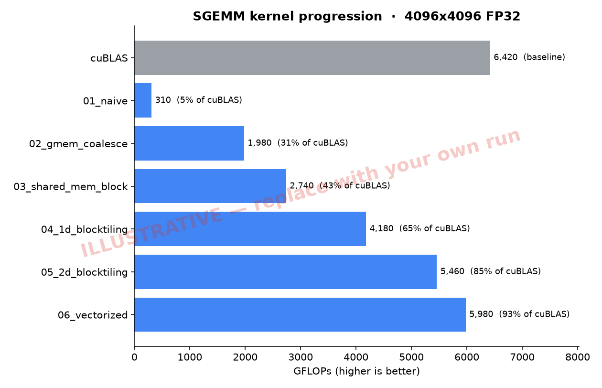

# CUDA SGEMM — optimizing matrix multiply, kernel by kernel

Working through Simon Boehm's [**How to Optimize a CUDA Matmul Kernel for cuBLAS-like Performance**](https://siboehm.com/articles/22/CUDA-MMM). The goal: start from a naive SGEMM kernel and iteratively optimize it toward cuBLAS throughput, understanding *why* each step helps.

> ⚠️ The chart below uses **illustrative placeholder numbers** so the layout is visible. Real measurements land here once I run [`run_colab.ipynb`](run_colab.ipynb) on a GPU.



## Results

`size = 4096`, FP32, single T4 GPU. GFLOPs are throughput (higher is better); % is fraction of cuBLAS.

| # | Kernel | Idea | GFLOPs | % cuBLAS | Status |
|---|--------|------|-------:|---------:|:------:|
| 0 | cuBLAS | vendor baseline / ceiling | 6420 | 100% | 📊 example |
| 1 | `01_naive` | one thread per output, straight from global memory | 310 | 5% | ✅ done |
| 2 | `02_gmem_coalesce` | remap threads so warps read contiguous memory | — | — | 🚧 todo |
| 3 | `03_shared_mem_block` | tile into shared memory to reuse loads | — | — | 🚧 todo |
| 4 | `04_1d_blocktiling` | each thread computes a column of results | — | — | 🚧 todo |
| 5 | `05_2d_blocktiling` | each thread computes a 2D tile of results | — | — | 🚧 todo |
| 6 | `06_vectorized` | 128-bit vectorized loads (`float4`) | — | — | 🚧 todo |

## Writeups

### Kernel 1 — Naive
One thread per output element `C[x][y]`; each thread loops over `K`, reading a row of `A` and a column of `B` from global memory. Correct but slow: accesses are uncoalesced and every value of `A`/`B` is re-read many times from DRAM. This is the baseline everything else beats. → [`src/kernels/01_naive.cu`](src/kernels/01_naive.cu)

### Kernel 2 — Global memory coalescing
*TODO: what changed, why it's faster, the measured speedup.*

<!-- Add one short section per kernel as you implement it. -->

## Layout

```
src/
  kernels/       one .cu per kernel version (01_naive is real; 02-06 are stubs)
  kernels.cuh    launch-function declarations
  runner.cu      harness: alloc, time (CUDA events), verify vs cuBLAS
benchmark/
  run_benchmarks.sh   run all kernels -> results.csv
  plot.py             results.csv -> assets/benchmark.png
  results.csv         your measurements (committed = proof of work)
run_colab.ipynb  clone -> compile -> benchmark -> chart, on a free T4
Makefile         local build (needs an NVIDIA GPU + nvcc)
```

## How to run

I'm on Apple Silicon (no NVIDIA GPU), so builds happen on a GPU in the cloud:

1. Push this repo to GitHub.
2. Open `run_colab.ipynb` in [Google Colab](https://colab.research.google.com/), set runtime to **T4 GPU**, edit the repo URL cell, and Run All.
3. It compiles, benchmarks, and regenerates `assets/benchmark.png`. Commit `results.csv` + the PNG back.

Have a local NVIDIA GPU instead? `make ARCH=sm_XX && ./benchmark/run_benchmarks.sh`.

## Working through it

Each kernel is one file + one commit + one table row + one writeup paragraph. To add the next kernel: implement its `run_kernel_N` in the matching `.cu`, re-run the notebook, fill in the table and a writeup section.
